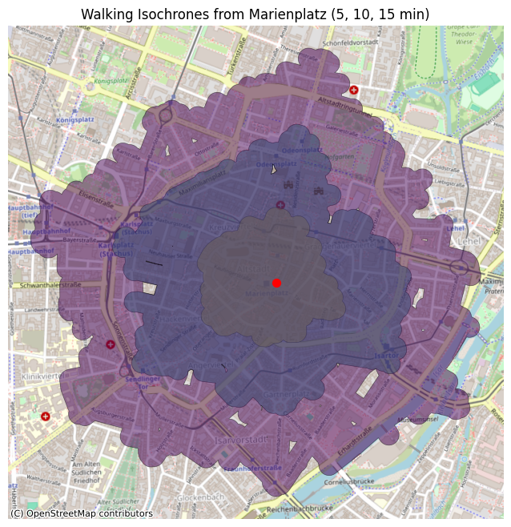

# Generated 5, 10 and 15 minute walking isochrones from Marienplatz center
<picture>
 
</picture>

The project was done in order to get familiar with Geospatial data and libraries. 

Self-contained Jupyter notebook that installs the required dependencies.

| No. | Libraries |
|----:|-----------|
|  1  |   OSMnx   |
|  2  | GeoPandas |
|  3  | MatPlotLib|
|  4  | CONTEXTILY|

Walking Speed: Assumed 1.39 m/s (5 km/h)

Time windows: 5 mins, 10 mins and 15 mins

Marienplatz coordinates: (48.137154, 11.576124)

# Munich walkable network
<picture>
 
</picture>